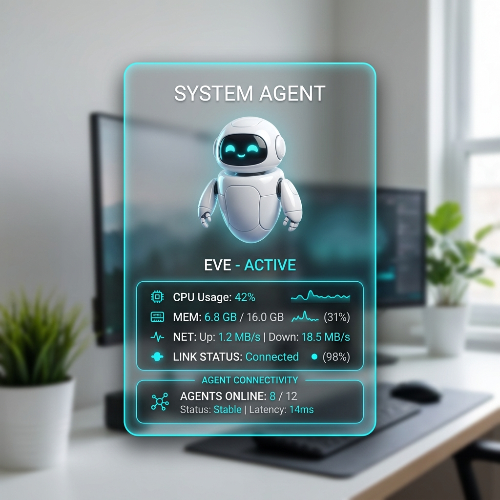

# 🚀 EveFlow — Compagnon de Bureau Rétro-Futuriste 3D

[](https://github.com/R0m1k3/EveFlow)
[](https://github.com/R0m1k3/EveFlow/releases/tag/v1.0.3)
[](LICENSE)

**EveFlow** est un compagnon de bureau Windows immersif haut de gamme, combinant une esthétique cyberpunk rétro-futuriste soignée et des technologies d'intelligence artificielle avancées. Il intègre un assistant virtuel en 3D nommé **Eve**, animé en temps réel avec des expressions émotionnelles dynamiques et synchronisé avec des services de synthèse vocale (TTS/STT) locaux et des architectures multi-agents.

---

## 📸 Aperçu de l'Interface

Découvrez le cockpit de contrôle immersif et le mode widget compact d'EveFlow :

<table>
  <tr>
    <td align="center"><strong>Cockpit Principal (Mode Discussion & Télémétrie)</strong></td>
    <td align="center"><strong>Widget Flottant (Mode Compact Transparent)</strong></td>
  </tr>
  <tr>
    <td></td>
    <td></td>
  </tr>
</table>

---

## ✨ Fonctionnalités Clés

* **🤖 Avatar 3D Eve Interactif** : Un modèle 3D animé sous WebGL avec des shaders personnalisés pour ses yeux LED. Ses expressions (joie, tristesse, réflexion, colère, surprise, neutre), son clignotement de paupières et ses mouvements de bras s'adaptent de manière organique selon le contexte et la parole.
* **🌌 Interface Transparent Glassmorphic Premium** : Fenêtre sans bordure avec un effet de verre dépoli haut de gamme, s'intégrant magnifiquement à votre bureau Windows sans perturber votre espace de travail.
* **🔄 Deux Modes d'Affichage Dynamiques** :
  * **Mode Cockpit** : Interface complète de discussion avec panneau de commande, historique des messages, affichage des logs et télémétrie matérielle avancée.
  * **Mode Flottant (Widget)** : Une carte compacte translucide toujours au premier plan, plaçant l'avatar d'Eve directement dans le coin de votre écran pour une compagnie discrète.
* **🔌 Serveur Webhook Intégré (Hermes)** : Port d'écoute webhook local (`7842`) permettant la réception d'événements et de notifications poussés en temps réel par des agents tiers (comme Telegram ou des scripts d'automatisation).
* **🖥️ Télémétrie CPU en Temps Réel** : Suivi des performances de votre ordinateur (fréquence CPU et température thermique calculée selon la charge réelle) directement intégré sous forme d'afficheurs analogiques virtuels futuristes.
* **🔒 Sécurité Zero Trust** : Isolation du contexte Chromium activée (`contextIsolation`), interdiction de l'intégration directe de Node dans le renderer et vérification stricte des extensions de fichiers lors des opérations de lecture/écriture de fichiers partagés via IPC.

---

## 🛠️ Stack Technique

* **Framework Applicatif** : [Electron](https://www.electronjs.org/) (Zéro Trust)
* **Frontend** : [React](https://react.dev/) + [Vite](https://vitejs.dev/) + [TypeScript](https://www.typescriptlang.org/)
* **Moteur 3D** : [Three.js](https://threejs.org/) via [@react-three/fiber](https://github.com/pmndrs/react-three-fiber) et [@react-three/drei](https://github.com/pmndrs/drei)
* **Serveur Webhook** : Node.js `http` (Port `7842`)

---

## 🚀 Installation & Lancement en Développement

### Prérequis
* [Node.js](https://nodejs.org/) (Version 20 recommandée)
* [Git](https://git-scm.com/)

### Étapes d'installation
1. **Cloner le dépôt** :
   ```bash
   git clone https://github.com/R0m1k3/EveFlow.git
   cd EveFlow
   ```
2. **Installer les dépendances** :
   ```bash
   npm install
   ```
3. **Lancer l'application en mode développement** :
   ```bash
   npm start
   ```
   *Cette commande démarre le serveur de développement Vite à l'adresse `http://localhost:5173` puis lance Electron en mode connecté.*

---

## 📦 Compilation & Packaging (Production)

Pour générer l'exécutable d'installation Windows (`.exe`) autonome :

1. **Compiler le bundle frontend** :
   ```bash
   npm run build
   ```
2. **Générer le package d'installation Windows** :
   ```bash
   npm run dist
   ```
   *L'exécutable d'installation NSIS (`EveFlow Setup 1.0.3.exe`) et la build décompressée seront générés dans le dossier `./out/`.*

---

## 📜 Licence

Ce projet est sous licence MIT. Consultez le fichier [LICENSE](LICENSE) pour plus de détails.
